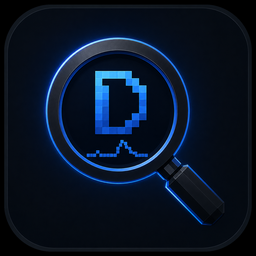

<p align="center">
  
</p>

# DETECTIVE

**Modpack diagnostics, without the guesswork.**

Detective is a client-side Minecraft mod that records evidence around freezes and other render-thread performance stalls. It helps players understand what happened, review probable mod suspects, and create a small local report that can be shared with a mod developer or modpack author.

**Detect. Measure. Explain. Never accuse.**

Detective ranks suspects from captured execution evidence. A Primary Suspect is not proof that a mod is defective or solely responsible: configuration, game state, another mod, or an interaction between components may also matter.

## EARLY ALPHA

Detective's core detection, attribution, UI, and Support Reports have been validated, including a smoke test with **257 loaded mod IDs**.

Long-duration validation on Medium, Large, and Stress modpacks is still ongoing. Users should keep backups and report unexpected behavior.

## Features

- **Automatic freeze detection** — watches active gameplay for meaningful render-thread stalls using an adaptive threshold.
- **Black Box** — keeps recent frame time, FPS, JVM memory, dimension, and position history around an Incident.
- **Primary Suspect** — ranks the mod with the strongest captured execution evidence while using cautious language.
- **Evidence-based attribution** — preserves leaf ownership, stack presence, sample counts, and other technical evidence.
- **Ambiguous Attribution** — explicitly declines to choose one mod when several suspects have similar evidence.
- **Honest unknown states** — distinguishes insufficient evidence and possible JVM, GC, native, or driver stalls instead of inventing a named suspect.
- **Modpack Changes** — compares installed mod names and versions with the previous recorded launch.
- **Support Reports** — exports a lightweight local ZIP with human-readable summaries and schema-versioned JSON.
- **Daily-use controls** — optional Incident notifications, bounded history retention, and essential settings.

Detective is client-side only. It has no telemetry, performs no automatic upload, and does not need to be installed on a server.

## Installation

Requirements:

- Minecraft **1.21.1**
- NeoForge **21.1.235 or newer in the 21.1.x line**
- Java **21**

Steps:

1. Install NeoForge for Minecraft 1.21.1.
2. Place `detective-0.7.0-alpha.1.jar` in the client instance's `mods` folder.
3. Start Minecraft and open Detective from the title screen or pause menu.

No server installation is required. NeoForge **21.1.248** is the recommended tested runtime; a later compatible 21.1.x version may work, but versions not listed below have not been independently validated by the project.

## Compatibility

| Component | Validated support |
|---|---|
| Minecraft | 1.21.1 |
| Java | 21 |
| NeoForge minimum validated | 21.1.235 |
| NeoForge also validated | 21.1.238 |
| NeoForge recommended/test runtime | 21.1.248 |
| Environment | Client-side only |

Compatibility with a particular modpack also depends on the NeoForge and dependency requirements of its third-party mods.

## Using Detective

When Detective records an Incident, open its detail screen to review:

- duration, active threshold, dimension, and coordinates;
- attribution state and Evidence strength;
- Primary Suspect and Other Suspects, when the evidence supports attribution;
- Technical Evidence from captured watchdog samples;
- the Black Box performance history around the stall.

Use **Export Support Report** from an Incident detail or the Detective dashboard to create a local ZIP. Review the ZIP before sharing it, just as you would any diagnostic file.

## Privacy

Detective stores its data locally under the game instance's `detective` directory. It contains no telemetry, analytics, automatic uploads, remote API calls, or update checker.

Standard Support Reports do not include `latest.log`, JARs, saves, screenshots, memory dumps, account/session data, server addresses, or personal paths. See [PRIVACY.md](PRIVACY.md) for the complete policy.

## License

Detective is distributed under the **Detective Proprietary License 1.0**. See [LICENSE](LICENSE) for the complete terms.

## Known limitations

- Long-duration Medium/Large/Stress modpack soaks are not yet complete.
- A short compatibility smoke passed with 166 physical JARs and 257 loaded mod IDs, but it is not a substitute for a long stable soak.
- Physical Alt+Tab, the full resolution/GUI-scale matrix, keyboard navigation, and `Open Folder` behavior still require final human validation.
- Detective can only explain the evidence it captures; some stalls remain ambiguous, system-related, or unknown.

## Reporting a bug

Use the repository's [bug report template](.github/ISSUE_TEMPLATE/bug_report.yml). Include the Detective, Minecraft, and NeoForge versions, the modpack or mod list, reproduction steps, and a Detective Support Report when available.

Inspect every report before sharing it. Never post access tokens, session data, private server addresses, personal identifiers, or other secrets.

## Building from source

A Java 21 JDK is required. The repository includes the Gradle Wrapper.

```powershell
.\gradlew.bat clean build --no-daemon
.\gradlew.bat test --no-daemon
```

The public JAR is written to `build/libs`. Development validation source sets are compiled by checks but are not packaged into the public artifact.

## Project philosophy

**Detective finds the evidence. You make the call.**
